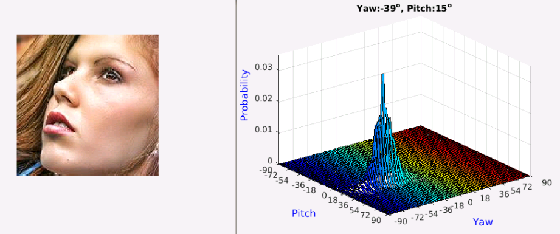
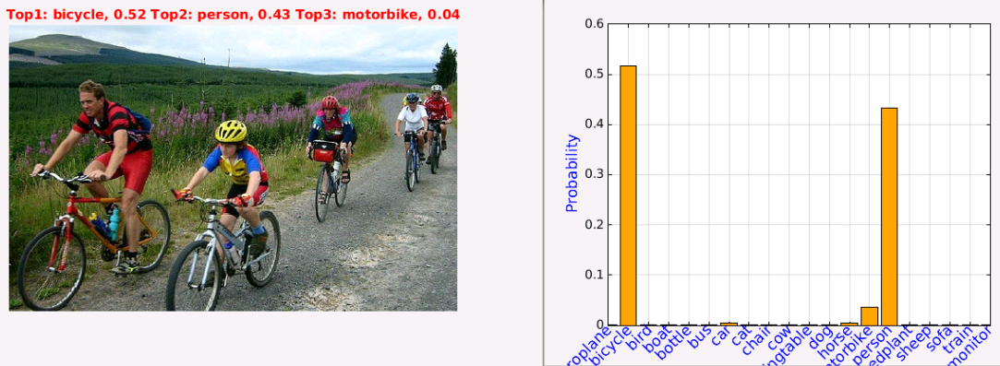

# DLDL-MatConvNet

This repository is a MatConvNet re-implementation of ["Deep Label Distribution Learning with Label Ambiguity", Bin-Bin Gao, Chao Xing, Chen-Wei Xie, Jianxin Wu, Xin Geng](https://doi.org/10.1109/TIP.2017.2689998). The paper is accepted at [IEEE Trans. Image Processing (TIP), 2017].

You can train Deep ConvNets from Scratch or a pre-trained model on your datasets with limited samples and ambiguous labels. This repo is created by [Bin-Bin Gao](http://lamda.nju.edu.cn/gaobb).


### Table of Contents
0. [Age-Estimation](#Age-Estimation)
0. [Head-Pose-Estimation](#Head-Pose-Estimation)
0. [Multi-Label-Classification](#Multi-Label-Classification)
0. [Semantic-Segmentation](#Semantic-Segmentation)

### Age-Estimation
step1: download pre-trained model from [here](https://pan.baidu.com/s/1jIpGy6U)　to ./SimModel

step2: in matlab, run age-demo.m


### Head-Pose-Estimation
step1: download pre-trained model from [here](https://pan.baidu.com/s/1jIOSuSA) to ./SimModel

step2: in matlab, run age-demo.m



### Multi-Label-Classification
step1: download pre-trained model from [here](https://pan.baidu.com/s/1kV69uxL) to ./SimModel

step2: in matlab, run ml-demo.m



### Semantic-Segmentation
step1: download pre-trained model from [here](https://pan.baidu.com/s/1pLUhK9P) to ./SimModel

step2: in matlab, run seg-demo.m


### Additional Information
If you find DLDL helpful, please cite it as
```
@ARTICLE{gao2016deep,
         author={Gao, Bin-Bin and Xing, Chao and Xie, Chen-Wei and Wu, Jianxin and Geng, Xin},
         title={Deep Label Distribution Learning with Label Ambiguity},
         journal={IEEE Transactions on Image Processing},
         year={2017},
         volume={26},
         number={6},
         pages={2825-2838}, 
         }
```

ATTN1: This packages are free for academic usage. You can run them at your own risk. For other
purposes, please contact Prof. Jianxin Wu (wujx2001@gmail.com).

